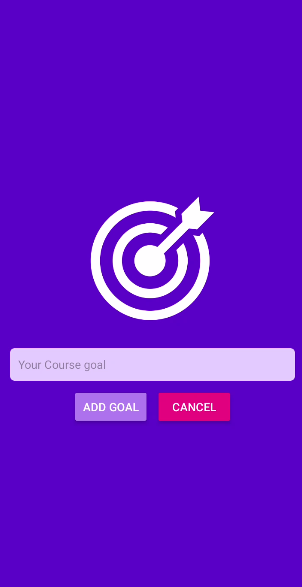
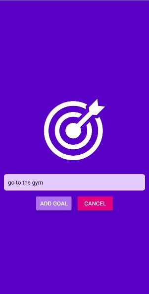

# Goals App

A simple React Native app to add, view, and manage your course goals.

## Features

- Add new goals using a modal input
- View a list of your goals
- Delete goals by tapping on them
- Clean and colorful UI

## Screenshots

### Home Screen


### Add Goal Modal (with text)



### Add Goal Modal (empty)



### Empty State


## Getting Started

1. Clone the repository:
   ```sh
   git clone https://github.com/rahmarihan/Goals.git
   ```
2. Install dependencies:
   ```sh
   npm install
   ```
3. Run the app:
   ```sh
   npx expo start
   ```

## License

This project is licensed under the MIT License.
